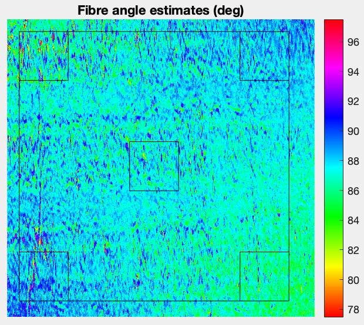

<h1 align="center">
  <br>
  <a></a>
  <br>
  Photometric Stero Rig
  <br>
</h1>

<!-- Description -->
<h4 align="center">Photometric stereo for composite surface inspection for Mechanical engineering final year project.</h4>

<!-- Badges -->
<!-- <p align="center">
  <a href="https://gitter.im/amitmerchant1990/electron-markdownify"></a>
  <a href="https://saythanks.io/to/bullredeyes@gmail.com">
      
</p> -->

<p align="center">
  <a href="#structure">Structure</a> •
  <a href="#how-to-use">How To Use</a> •
  <a href="#credits">Credits</a> •
  <a href="#license">License</a>
</p>

<!-- Gif -->
<!--  -->

## Structure

```bash
├───data-acquisition
│   ├───3d-models
│   ├───image-capture
│   └───motor-control
├───image-analysis
└───docs
```

## How To Use

To clone and run this application, you'll need [Git](https://git-scm.com). From your command line:

```bash
# Clone this repository
$ git clone https://github.com/coolbotic/photometric-stereo.git

# Go into the repository
$ cd photometric-stereo

...tbc
```

<!-- > **Note**
> If you're using Linux Bash for Windows, [see this guide](https://www.howtogeek.com/261575/how-to-run-graphical-linux-desktop-applications-from-windows-10s-bash-shell/) or use `node` from the command prompt. -->

<!-- ## Download

You can [download](https://github.com/amitmerchant1990/electron-markdownify/releases/tag/v1.2.0) the latest installable version of Markdownify for Windows, macOS and Linux. -->

## Credits

This software uses the following open source packages:

- [README.md Template](https://github.com/amitmerchant1990/electron-markdownify#readme)

<!-- ## Related
[markdownify-web](https://github.com/amitmerchant1990/markdownify-web) - Web version of Markdownify -->

<!-- ## Support -->

<!-- ## You may also like...
- [Pomolectron](https://github.com/amitmerchant1990/pomolectron) - A pomodoro app
- [Correo](https://github.com/amitmerchant1990/correo) - A menubar/taskbar Gmail App for Windows and macOS -->

## License

MIT

---

> [jamesbarson.com](https://www.jamesbarson.com/) &nbsp;&middot;&nbsp;
> GitHub [@coolbotic](https://github.com/coolbotic)
